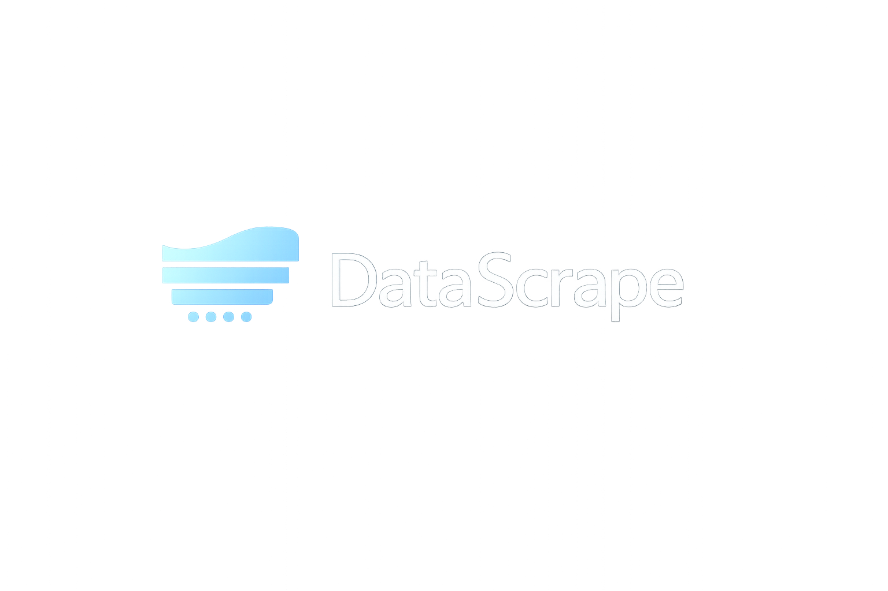

<div align="center">
  

  # DataScrape

  Get data from the web easy.

  
  
  
  

  [](https://github.com/andresnalegre/DataScrape/releases)
  [](https://github.com/andresnalegre)
</div>

---

## About

**DataScrape** is a desktop app available for macOS that scrapes any website and saves its HTML content and resources locally. Just provide a URL and a destination folder, and DataScrape takes care of the rest.

## Features

- Scrape any website by URL
- Downloads and localizes page resources (CSS, JS, images)
- Save output to any local directory
- Live log output with status updates
- Headless Chrome via Selenium
- macOS DMG available

---

## Installation (macOS)

### 1. Download
Download `DataScrape.dmg` from the [Releases](https://github.com/andresnalegre/DataScrape/releases) page.

### 2. Install
Open the DMG and drag DataScrape.app to your Applications folder.

### 3. First Launch
macOS will block the app on first launch because it's not signed. Run this once in Terminal:

```bash
xattr -cr /Applications/DataScrape.app
```

Then open DataScrape from Applications or Launchpad normally.

---

> **Note:** Chrome must be installed on your machine for the scraper to work.

---

## License

This project is licensed under the [MIT License](LICENSE).

## Contributing

Contributions are welcome! Feel free to fork the repository and submit a pull request. Please ensure your code follows the existing style and structure.
